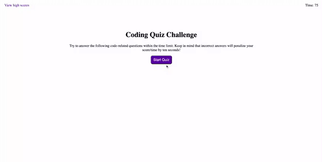

# Module 4 Challenge: Web APIs Coding Quiz

## Description

I built a timed coding quiz with multiple-choice questions. This app runs in the browser, and features dynamically updated HTML and CSS powered by JavaScript code. I used Web APIs to create, get, and append elements. I added event listeners to DOM elements and used client-side storage to store data locally within the user's browser.

Click [here](https://sieraford.github.io/web-apis-code-quiz-siera/) to view the application.

## Screenshots

## Installation

N/A

## Usage

When you visit the application, you will be presented with a code quiz. When you click the start button, a timer starts and you are presented with a question. When you answer the question, you are presented with another question. If you answer the question incorrectly, 10 seconds will be deducted from the timer. When all questions are answered for the timer reaches 0, then the game is over. When the game is over, you can save your initials and score. When you click "view high scores", you can see the list of stored high scores.

## Credits

N/A

## License

N/A
